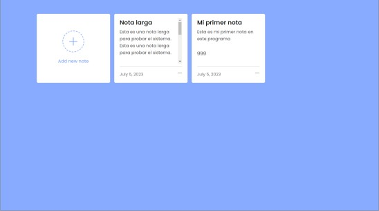
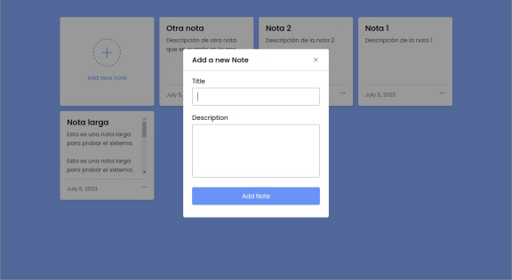

# Aplicación Mini de Notas en JavaScript

Este proyecto es una aplicación simple de notas implementada en JavaScript puro, HTML y CSS. Los usuarios pueden agregar, editar y eliminar notas según sea necesario.

## Características

El proyecto incluye las siguientes funcionalidades:

- Los usuarios pueden agregar nuevas notas usando un formulario emergente.
- Las notas existentes se pueden editar haciendo clic en el ícono de lápiz en cada nota.
- Las notas también se pueden eliminar haciendo clic en el ícono de basura.
- Todas las notas se guardan en el almacenamiento local del navegador, por lo que persisten después de cerrar y abrir la página.

## Estructura del Código

- El archivo HTML proporciona la estructura para la aplicación, incluyendo un formulario emergente para crear y editar notas y una sección donde se mostrarán las notas. Además, se enlaza al archivo JavaScript correspondiente.
- El archivo JavaScript proporciona la funcionalidad de la aplicación mediante las siguientes funciones y acciones:

  - Inicialmente, se seleccionan varios elementos del DOM y se asignan a variables para su posterior manipulación. Se recupera una lista de notas existentes del almacenamiento local del navegador.
  - Un "eventListener" se adjunta al cuadro "Agregar nueva nota" que, al hacer clic, muestra un formulario emergente.
  - Cuando se hace clic en el ícono de cierre en el formulario emergente, se limpian los campos y se oculta el formulario.
  - La función `showNotes()` se encarga de mostrar todas las notas existentes en la página. Esta función borra cualquier nota existente en el DOM y crea nuevas notas basadas en el array de notas.
  - Las funciones `updateNote()` y `deleteNote()` se usan para modificar las notas existentes. La función `updateNote()` muestra el formulario emergente con los detalles de la nota existente, preparándola para la actualización. Por otro lado, `deleteNote()` se encarga de eliminar una nota tanto de la matriz como del almacenamiento local.
  - Finalmente, se agrega un "eventListener" al botón del formulario que guarda la nota en la matriz y en el almacenamiento local, y luego actualiza la lista de notas en el DOM.

## Prueba la Aplicación

Para probar la aplicación, simplemente ve a la página de demostración alojada en GitHub Pages haciendo click en el siguiente enlace:

* https://pablospata.github.io/note-app-js/